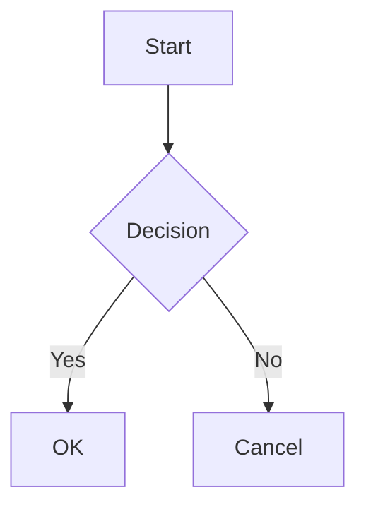

# Mermaid Diagram Converter

A Python utility that converts Mermaid diagram files to high-resolution PNG images with optimized settings and transparent backgrounds.

## Features

- Batch conversion of `.mmd` files to PNG format
- High-resolution output with customizable scaling
- Transparent background support
- Optimized diagram settings for better readability
- Configurable font sizes and spacing
- Error handling and detailed logging

## Prerequisites

- Python 3.6 or higher
- Node.js and npm installed

## Installation

1. Clone this repository:
```bash
git clone https://github.com/doomL/mermaid-bulk-converter
cd mermaid-bulk-converter
```

2. Install Python dependencies:
```bash
pip install pathlib
```

3. Install Mermaid CLI:

**Method 1: Local Installation (Recommended)**
```bash
npm install -g @mermaid-js/mermaid-cli
```

## Usage

Run the script from the command line:

```bash
python mermaid-bulk-converter.py -i /path/to/input/directory -o /path/to/output/directory -s 3.0
```

### Arguments

- `-i, --input`: Directory containing Mermaid (`.mmd`) files
- `-o, --output`: Directory where PNG files will be saved
- `-s, --scale`: Scale factor for PNG resolution (default: 3.0)

## Example

1. Create a Mermaid diagram file `flowchart.mmd`:


2. Convert to PNG:
```bash
python mermaid-bulk-converter.py -i ./diagrams -o ./output -s 4.0
```

## Configuration

The script uses optimized default settings for:
- Font size and family
- Diagram padding and spacing
- Node layout and dimensions
- Background transparency
- Device scale factor

These settings can be modified in the `config` dictionary within the script.

## Error Handling

The script includes comprehensive error handling:
- Creates missing output directories
- Reports conversion errors for individual files
- Cleans up temporary files
- Provides detailed error messages

## License

MIT License

## Contributing

1. Fork the repository
2. Create a feature branch
3. Commit your changes
4. Push to the branch
5. Create a Pull Request
